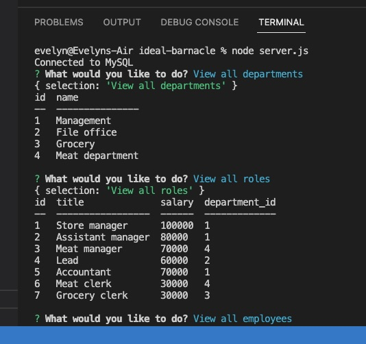
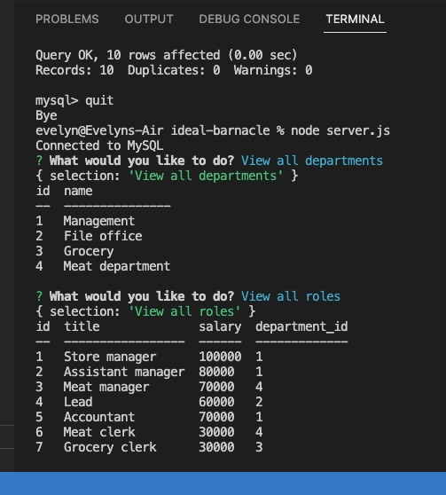
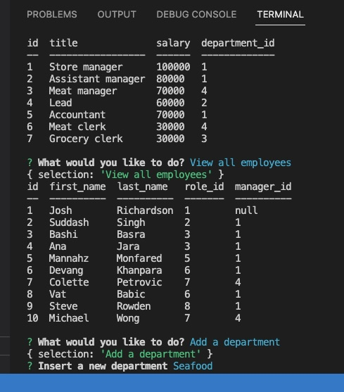

# SQL: Employee Tracker

## Description

Create a **content management systems (CMS)**.  
Build a command-line application from scratch to manage a company's employee database, using Node.js, Inquirer, and MySQL.

## Installation
Clone the repo from GitHub, and install node.js on your computer, in the command line, install npm, run node server.js.

## Mock-Up

The following images show the web application's appearance and functionality:

### Walkthrough Video:

Clicking [this link](https://drive.google.com/file/d/16_R4Ii1icnAS7S89n7bc7KvLNPI1JRhE/view) you will find the video with the demonstration of the app.